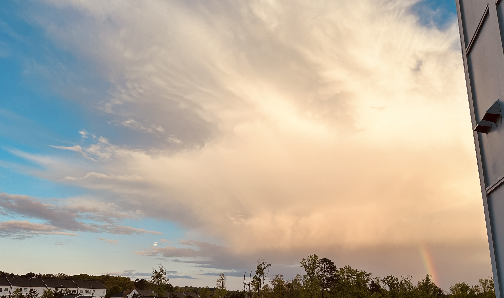

### Hi, I'm Carly!

A technical writer and weather communicator passionate about turning storm science and tech into clear, educaitonal content. I focus on making complex concepts into accessible, actionable, and engaging for all types of users. 

## Main Skills
 

## Currently Studying

## Publicaitons  

## Let's Connect 
[My Linkedin](https://www.linkedin.com/in/carlyannawx/) 

